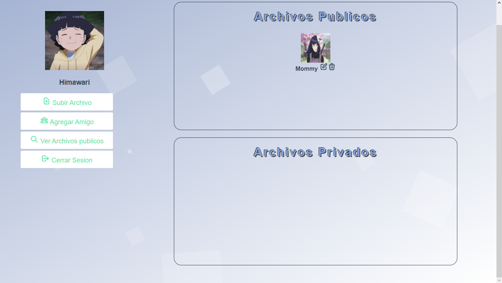
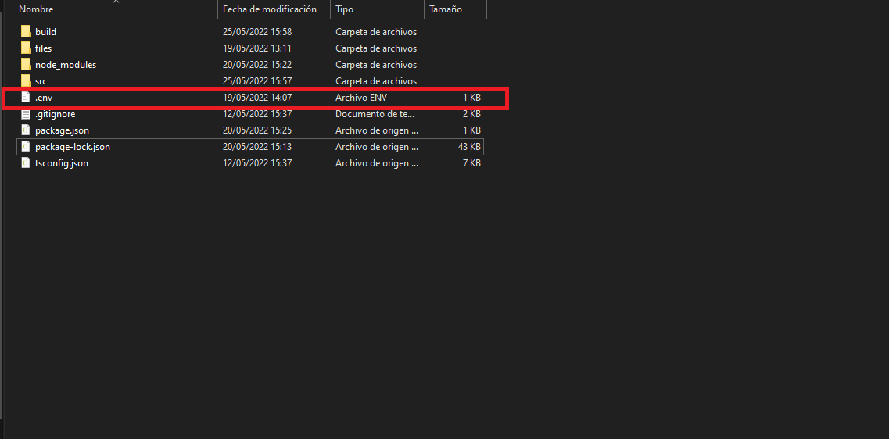
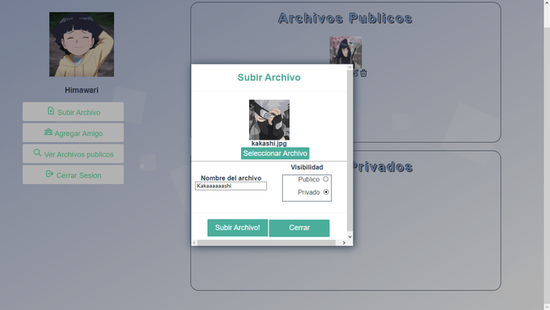

# Semi1-29-Proyecto1

| Nombre                             | Email|
|------------------------------------|-----------|
| Juan Antonio Pineda Espino              | jpinedaespino@gmail.com |

  <p align="center"> 
  
  </p>

<hr>

## About the Project

<p align="center"> 
  
</p>

This webapp allows you to create users and upload files to your own database. The goal was to create/simulate a file storage app and deploy it to AWS using VPCs , EC2, S3, RDS(MySQL) and Load Balancer. You can see the assignment PDF [Here]([SEMI1]_Proyecto1_2S2021.pdf) (Spanish tho)

That being said, The version right here (latest commit) is a <em>**local**</em> version that works on your <em>**own computer**</em> 

### Built With
* Frontend: [Vue.js](https://vuejs.org)
* Backend: 
  * [Typescript](https://jquery.com)
  * [NodeJS](https://nodejs.org)
  * [Express](https://expressjs.com)
* Database: [MySQL](https://www.mysql.com)


> :warning: **Important**: Remember this was a college project. This App was developed in 1-2 weeks, so there's probably some not good looking Vue, JS & HTML/CSS practices. :warning:

<!-- GETTING STARTED -->
## Getting Started

### Prerequisites

* NodeJS
* npm
  ```sh
  npm install npm@latest -g
  ```
* MySQL 

### Installation

1 Clone the repo
   ```sh
   git clone https://github.com/JPineda12/Semi1-29-Proyecto1.git
   ```
2 Go to the folder [Frontend](Frontend) and Install NPM packages
   ```sh
   npm install
   ```
3 Go to the folder [Backend](Backend) and install NPM packages
   ```sh
   npm install
   ```
4 Create the Database
  - On your own MySQL instance run the .sql script from this repo called [scripttablas.sql](scripttablas.sql). This script includes the tables and the initial data that the app needs to work properly. You can see the database diagram [Here](doc-imgs/diagrama.svg) (Relational Model).

5 For the backend to work you need a .env file (in the backend directory) with your own credentials, it should look like this: 
   ```sh
   #NodeJS Port
      PORT=3000 #The port you want the backend to be (If you change the default (3000), you should also change it in frontend's main.js file )
   #MySQL Credentials
    USER_MYSQL      = yourname
    PASSWORD_MYSQL  = yourpassword
    HOST_MYSQL      = localhost #where your MySQL instance is hosted
    PORT_MYSQL      = 3306  #Default port
    DATABASE_MYSQL  = semi1_proyecto1 #Name of the database (this is the default that is created in scripttablas.sql
    #HTTP server for files (the filed that are uploaded when you create a new user (profile picture), or upload files to your drive (imgs or PDFS)
    FILES_SERVER_URL = "http://localhost:3030"
   ```
  <p align="center"> 
  
  </p>


### Usage
1. Run Backend using:
   ```sh
   npm run start
   ```
2. Run Frontend using:
   ```sh
   npm run serve
   ```
### The App 

The frontend runs on vue default port 8080. 

```
http://localhost:8080
```
#### Login


#### Home Page


#### File Viewing

